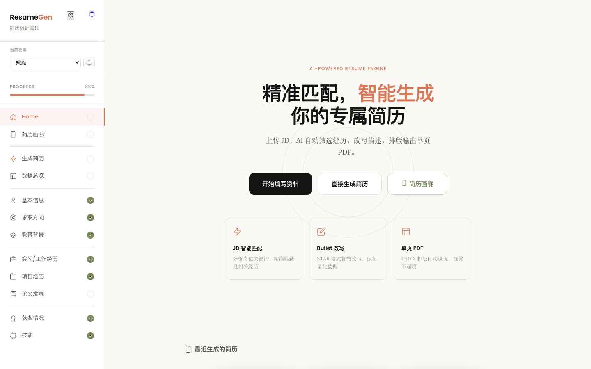
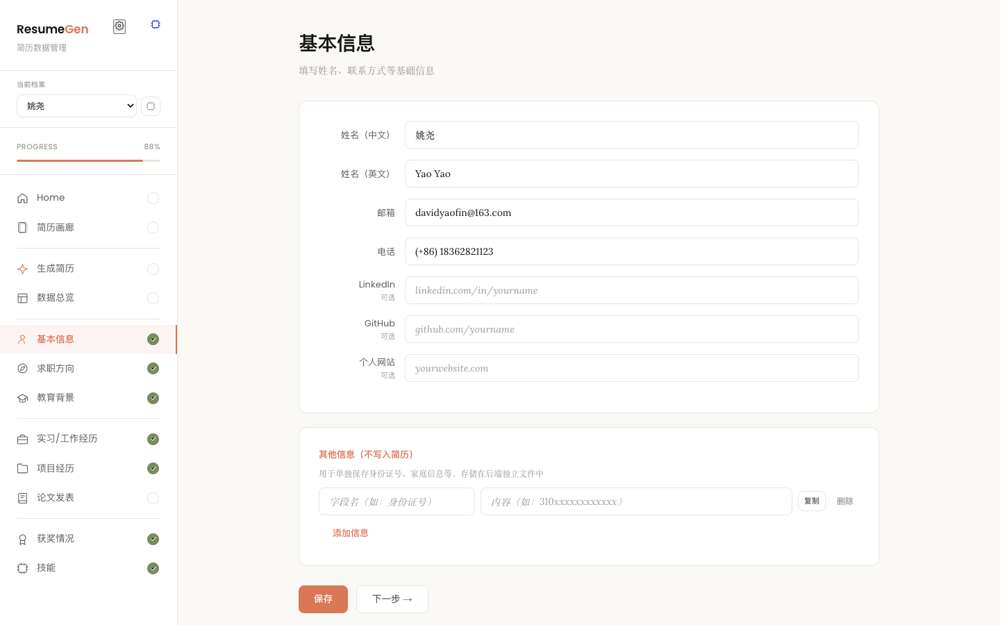
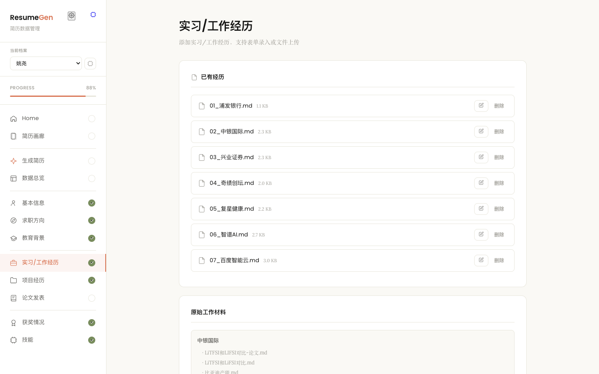
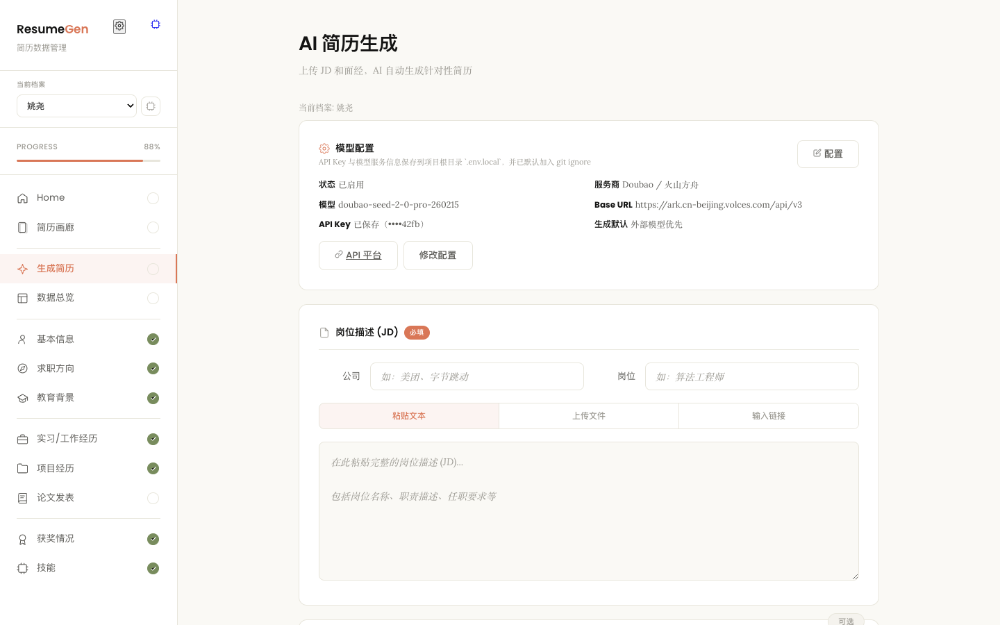
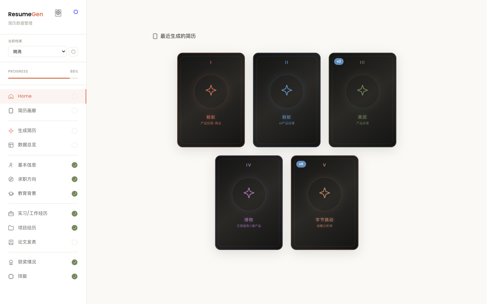
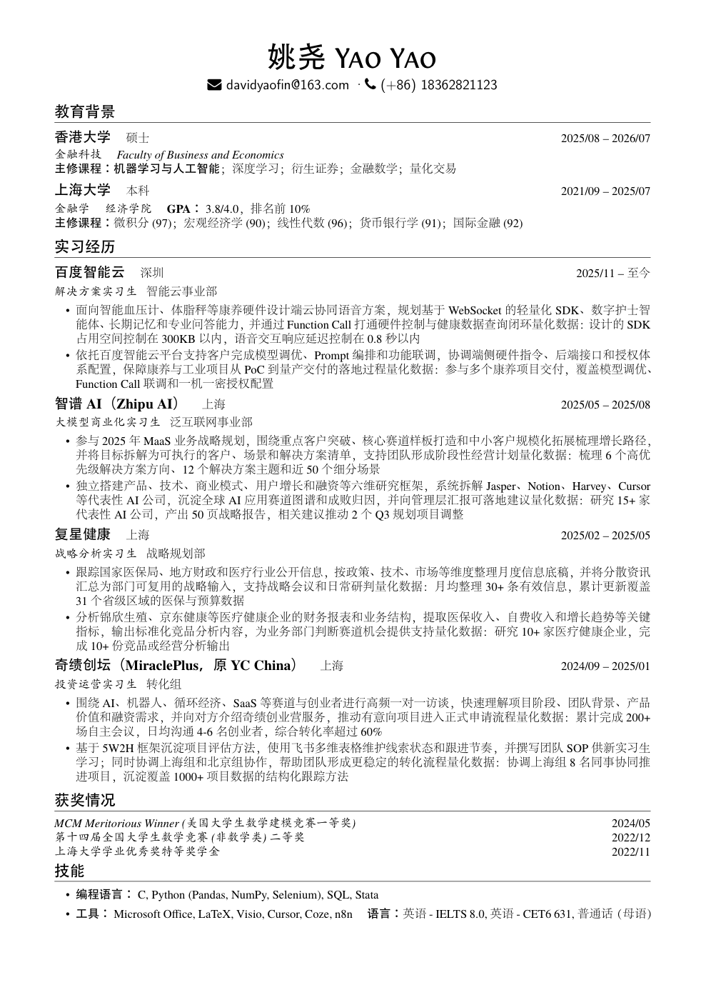
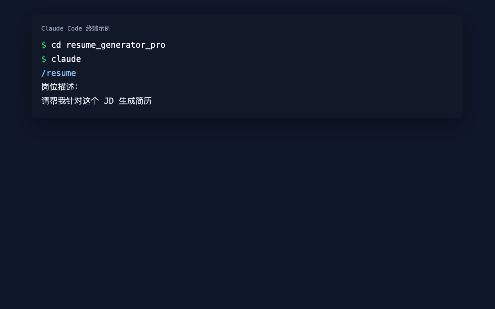

# Resume Generator Pro

> 输入 JD，自动生成单页 PDF 简历 — 基于 Claude Code + LaTeX 的岗位针对性简历生成系统

[](#skill-安装指南)
[](#环境要求)
[](#license)

---

## 效果展示

### Web UI 数据管理

<p align="center">
  
</p>

<details>
<summary>更多截图</summary>

| 个人信息填写 | 经历管理 |
|:---:|:---:|
|  |  |

| AI 简历生成 | 简历画廊 |
|:---:|:---:|
|  |  |

</details>

### PDF 输出示例

<p align="center">
  
</p>

### Claude Code 命令行

<p align="center">
  
</p>

> 截图资源说明见 `docs/screenshots/README.md`，可按需使用你本地环境生成并替换。

### 脱敏示例简历（可直接查看）

- 示例目录：`docs/examples/anonymized_pm_intern/`
- 示例 PDF：`docs/examples/anonymized_pm_intern/resume-zh_CN.pdf`
- 示例 LaTeX：`docs/examples/anonymized_pm_intern/resume-zh_CN.tex`
- 生成日志：`docs/examples/anonymized_pm_intern/generation_log.md`

---

## 功能特性

- **JD 智能分析** — 自动提取岗位关键词（技术栈、职能、行业、软技能）
- **可选多模型驱动** — 支持 OpenAI、Gemini、Anthropic、GLM、Kimi、MiniMax、Grok、Qwen、Doubao 与自定义兼容接口
- **经历自动匹配** — 根据关键词与经历标签的匹配度，智能选取 3-5 段最相关经历
- **Bullet 精准改写** — 动词名词向 JD 靠拢，保留量化数据，不捏造内容
- **LaTeX 编译 + 单页自动调优** — 自动处理超页/偏空，目标填充率 82%-99%
- **填充率检测** — 编译后自动检测页面饱满度，偏空则补充、溢出则缩减
- **多人档案管理** — 支持管理多个人的简历数据，按人员隔离存储和输出
- **Web UI 数据管理** — 可视化填写个人信息、管理经历、上传工作材料、在线生成
- **`/resume` Skill 一键触发** — 在 Claude Code 中粘贴 JD 即可生成
- **登录与配额治理（可选后端）** — 支持登录、免费/月3次、会员/周50次、BYOK 不限次
- **支付与会员状态** — 支持微信/支付宝下单与 webhook 幂等处理，会员有效期自动续期
- **BYOK 安全管理** — 支持按用户管理 API Key（加密存储、无明文回显、请求级优先覆盖）
- **可观测性与重试回收** — 预占结算重试、死信告警、无效签名告警与关键指标快照

---

## 适用人群

- 任何专业方向：产品、运营、技术、金融、咨询、研究……
- 应届毕业生 / 实习求职者
- 需要针对不同岗位定制化投递的求职者

---

## 快速开始

### 环境要求

| 依赖 | 说明 |
|------|------|
| [Claude Code](https://claude.ai/code) | Anthropic CLI（使用 `/resume` skill 时需要） |
| [TinyTeX](https://yihui.org/tinytex/) 或 TeX Live | XeLaTeX 编译器（中文字体支持） |
| Python 3.8+ | Web UI 服务器 + 工具脚本 |

### 安装步骤

#### 1. 克隆项目

```bash
git clone <your-repo-url> resume_generator_pro
cd resume_generator_pro
```

#### 2. 安装 TinyTeX（如尚未安装）

```bash
# macOS / Linux
curl -sL "https://yihui.org/tinytex/install-bin-unix.sh" | sh

# 验证
xelatex --version
```

> Windows 用户请参考 [TinyTeX 官网](https://yihui.org/tinytex/) 安装说明。

#### 3. 填写个人数据（两种方式任选）

**方式 A：Web UI（推荐）**

```bash
python3 web/server.py
# 浏览器自动打开 http://localhost:8765
```

在 Web 界面中依次填写：个人信息 → 经历 → 工作材料（可选）

**方式 B：手动编辑 Markdown**

```bash
# 1. 填写个人信息
#    打开 data/profile.md，将所有 [YOUR_XXX] 占位符替换为真实信息

# 2. 添加经历
#    复制模板并填写
cp data/experiences/_template.md data/experiences/01_公司名.md

# 3.（可选）放入原始工作材料
mkdir -p data/work_materials/公司名/
cp 你的报告.pdf data/work_materials/公司名/
```

> 详细说明请参考 [SETUP.md](SETUP.md)

#### 4. 生成第一份简历

```bash
# 在项目目录下打开 Claude Code，粘贴 JD：
/resume [粘贴JD内容]
```

#### 5. （可选）启用外部模型

如需让 Web UI / Python API 优先调用外部模型，请在本机运行前设置环境变量，或直接在 Web UI 的“模型配置”中保存到 `.env.local`：

```bash
export RESUME_USE_AI=1
export RESUME_MODEL_PROVIDER="gemini"
export RESUME_MODEL_NAME="gemini-3-flash-preview"
export RESUME_API_BASE_URL="https://generativelanguage.googleapis.com/v1beta"
export RESUME_API_KEY="你的 API Key"
```

未配置时，系统会继续使用本地规则引擎；若已启用外部模型但缺少 API Key / 模型名，则会直接报错而不是静默回退。

#### 6. （可选）启用 Auth/Billing 后端（登录、付费、配额）

当你要在部署版中启用“登录 + 会员 + 免费额度 + BYOK”时，启动 `backend/auth_billing_service` 并在 Web 服务注入以下环境变量：

```bash
export AUTH_BILLING_ENFORCE=1
export AUTH_BILLING_BASE_URL="http://127.0.0.1:8080"
export AUTH_BILLING_SERVICE_SECRET="change-this-service-secret"
export AUTH_BILLING_PAYMENT_WEBHOOK_SECRET="change-this-webhook-secret"
export AUTH_BILLING_BYOK_SECRET="change-this-byok-secret-32chars"
```

然后分别启动：

```bash
# 终端1：后端
python3 -m uvicorn backend.auth_billing_service.main:app --host 0.0.0.0 --port 8080

# 终端2：Web
python3 web/server.py
```

配额策略：

- `mode=platform_key`：免费用户每自然月 3 次；会员每自然周 50 次
- `mode=byok`：不限次，不走平台扣额

---

## 使用方式

### 方式一：Claude Code `/resume` 命令（推荐）

在项目目录下启动 Claude Code，直接粘贴 JD 或使用 skill：

```
/resume

岗位描述：
[粘贴 JD 内容]
```

或直接对话：

```
帮我针对这个岗位生成简历：[粘贴 JD 内容]
```

系统自动完成：**分析岗位 → 匹配经历 → 生成 LaTeX → 编译 PDF → 单页调优 → 填充率检查**

### 方式二：Web UI

```bash
python3 web/server.py
# 浏览器打开 http://localhost:8765
```

Web UI 提供四个功能页：

| 页面 | 功能 |
|------|------|
| 个人信息 | 可视化填写/编辑 `profile.md` |
| 经历管理 | 添加、编辑、删除经历；上传 `.md` / `.pdf` / `.zip` 文件 |
| AI 生成 | 输入 JD + 公司/岗位 → 调用生成引擎编译 PDF |
| 简历画廊 | 浏览、预览、下载已生成的简历 |

### 方式三：Python API

```python
from tools.generate_resume import generate_resume

result = generate_resume(
    jd_text="岗位描述内容...",
    interview_text="",           # 可选：面经内容
    company="公司名",            # 可选：覆盖自动提取
    role="岗位名",               # 可选：覆盖自动提取
    person_id="default"          # 可选：指定人员（默认活跃人员）
)
print(result)  # {'pdf_path': 'output/default/...', 'log_path': '...', ...}
```

---

## 项目结构

```
resume_generator_pro/
├── CLAUDE.md                  # Agent 主配置（核心工作流 + 规则）
├── README.md                  # 本文件
├── SETUP.md                   # 首次设置向导
│
├── data/                      ← 你的个人数据（首次使用需填写）
│   ├── persons.json           # 人员注册表（多人模式）
│   ├── _shared/experiences/   # 共享模板
│   ├── default/               # 默认人员
│   │   ├── profile.md         # 基本信息 + 教育 + 技能 + 获奖
│   │   ├── experiences/       # 每段经历一个 .md 文件
│   │   └── work_materials/    # 原始工作材料（可选）
│   └── {person_id}/           # 其他人员（可选）
│
├── skills/resume-gen/         ← Claude Code Skill
│   ├── SKILL.md               # Skill 定义（YAML frontmatter）
│   └── LICENSE.txt            # Apache 2.0 许可证
│
├── .claude/                   ← Claude Code 配置
│   ├── settings.json          # 已注册 skill
│   └── agents/
│       └── resume-generator.md
│
├── tools/                     ← 工具脚本
│   ├── generate_resume.py     # 简历生成引擎
│   ├── person_manager.py      # 多人档案管理模块
│   ├── migrate_to_multi_person.py # 单人→多人数据迁移
│   ├── page_fill_check.py     # 页面填充率检查
│   └── boundary_test.py       # 边界测试
│
├── web/                       ← Web UI
│   ├── server.py              # HTTP 服务器（纯 Python，零依赖）
│   └── index.html             # 单文件前端
│
├── backend/auth_billing_service/ ← 登录/付费/配额后端（FastAPI）
│   ├── main.py                # API 入口（auth/billing/byok/entitlement）
│   ├── models.py              # 内存数据模型（用户/订单/订阅/配额/BYOK）
│   ├── services/              # 业务服务
│   │   ├── auth_service.py
│   │   ├── session_service.py
│   │   ├── migration_service.py
│   │   ├── entitlement_service.py
│   │   ├── payment_service.py
│   │   └── byok_service.py
│   ├── workers/               # 异步补偿与回收
│   │   ├── finalize_retry_worker.py
│   │   └── reservation_recycle_worker.py
│   └── tests/                 # 后端测试
│
├── latex_src/resume/          ← LaTeX 模板
│   ├── resume-zh_CN.tex       # 主文件（中文简历）
│   ├── resume.cls             # 文档类（排版参数）
│   └── fonts/                 # 字体文件
│
├── output/                    ← 生成结果自动存放（按人员隔离）
│   └── {person_id}/{公司}_{岗位}_{日期}/
│       ├── resume-zh_CN.tex
│       ├── resume-zh_CN.pdf
│       └── generation_log.md
│
└── docs/                      ← 文档
    ├── examples/              # 脱敏示例简历
    └── screenshots/           # 截图资源说明与示例路径
```

---

## Skill 安装指南

如果你已有自己的 Claude Code 项目，可以单独安装 `/resume` skill：

### 方法一：复制 skill 目录

```bash
# 1. 将 skill 文件复制到你的项目
cp -r /path/to/resume_generator_pro/skills/resume-gen your-project/skills/resume-gen

# 2. 注册 skill（在 .claude/settings.json 中添加）
```

编辑 `.claude/settings.json`：

```json
{
  "skills": [
    "skills/resume-gen"
  ]
}
```

### 方法二：使用完整项目

直接克隆本仓库，在项目目录中使用 Claude Code 即可。所有配置已就绪。

### Skill 依赖

skill 运行需要以下资源在同一项目中：

- `data/{person_id}/profile.md` + `data/{person_id}/experiences/` — 用户数据
- `tools/person_manager.py` — 多人档案管理
- `latex_src/resume/` — LaTeX 模板
- `tools/page_fill_check.py` — 填充率检查
- `xelatex` — 系统 PATH 中可用

---

## 自定义配置

### 填充率阈值

在 `CLAUDE.md` 中定义，可根据需要调整：

| 填充率 | 状态 | 处理 |
|--------|------|------|
| >= 95% | 排版饱满 | 无需调整 |
| 82% ~ 95% | 理想范围 | 无需调整 |
| < 82% | 偏空 | 补充内容或扩大间距 |
| > 100% | 溢出 | 按调优策略缩减 |

### LaTeX 模板参数

在 `latex_src/resume/resume.cls` 中可调整：

```latex
% 页边距（红线：不低于 0.35in）
left=0.65in, right=0.65in, top=0.5in, bottom=0.5in

% 字号（红线：不低于 9pt）
\LoadClass[10pt]{article}

% section 间距
\titlespacing*{\section}{0cm}{*1.5}{*1.3}

% 列表间距
topsep=0.1em, itemsep=0.1em
```

---

## 常见问题

<details>
<summary><strong>Q: 编译报错怎么办？</strong></summary>

检查 `output/{目录}/resume-zh_CN.log` 中的错误信息。常见原因：
- 特殊字符未转义：`&` → `\&`，`%` → `\%`，`_` → `\_`
- 使用了 `pdflatex` 而非 `xelatex`（中文需要 XeLaTeX）
- TinyTeX 缺少宏包：运行 `tlmgr install <package-name>`
</details>

<details>
<summary><strong>Q: 经历内容写多详细？</strong></summary>

越详细越好。每条工作内容用 STAR 格式写（Situation → Task → Action → Result），包含具体数字。系统会根据 JD 自动筛选最匹配的 2-3 条，原始文件永远不会被修改。
</details>

<details>
<summary><strong>Q: 没有量化数据怎么办？</strong></summary>

尽量描述规模（文件数量、服务客户数、涉及金额等）。没有的不要捏造，系统只会改写和筛选你提供的真实内容。
</details>

<details>
<summary><strong>Q: 可以同时投多家公司吗？</strong></summary>

可以。每次生成的简历独立存放在 `output/{person_id}/{公司}_{岗位}_{日期}/` 目录下，互不影响。
</details>

<details>
<summary><strong>Q: Web UI 需要安装额外依赖吗？</strong></summary>

不需要。Web UI 使用 Python 标准库实现（`http.server`），零外部依赖。直接运行 `python3 web/server.py` 即可。
</details>

<details>
<summary><strong>Q: 如何修改简历模板样式？</strong></summary>

编辑 `latex_src/resume/resume.cls`（文档类）和 `latex_src/resume/resume-zh_CN.tex`（主文件）。修改后重新生成简历即可生效。
</details>

---

## License

本项目使用 [Apache License 2.0](skills/resume-gen/LICENSE.txt) 许可。
